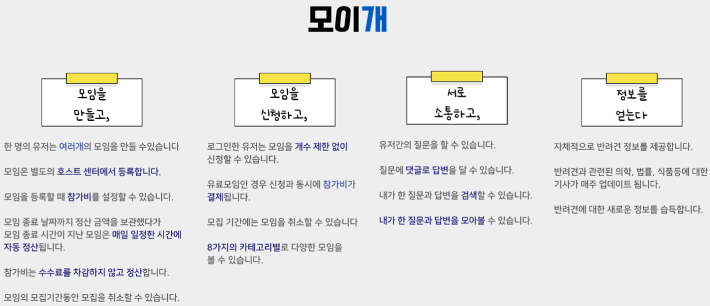

# 2023-moigae

 

### 🦮 만나고자 하면 모일 것이고, 모이고자 하면 만날 것이다.

  

### 프로젝트 소개

  

  

### 팀원 소개

|                                                                                                                                                                                                                                                            |                                                                                                                                                                                                                              |                                                                                                                                              |
|:-------------------------------------------------------------------------------------------------------------------------------------------------------------------------------------------------------------------------------------------------------------------------------------------------:|:-------------------------------------------------------------------------------------------------------------------------------------------------------------------------------------------------------------------------------------------------------------------:|:-----------------------------------------------------------------------------------------------------------------------------------------------------------------------------------:|
|                                                                                                                                                홍정완                                                                                                                                                |                                                                                                                                 최욱재                                                                                                                                 |                                                                                         양정아                                                                                         |
| Spring Batch를 활용한 정산, 모임 로직 자동화   단위 및 통합 테스트를 도입하여,   총 122개의 테스트 케이스 구현에 100% 기여    토스 페이먼츠 결제 API를 이용한 모임 결제 기능 구현    모임 등록, 상세 조회, 중복 카테고리를 적용한 목록 조회, 모임 신청, 정산 내역 기능 등 구현    팀 내, JPA(Java Persistence API) 도입 및 도메인 구현    데일리 스크럼 도입으로 기존 회의 시간 대비 70% 개선 | ERD(Entity Relationship Diagram) 설계    Spring Security를 활용한 인증/인가    Jenkins와 AWS를 활용한 CI/CD 파이프라인 구축    smtp 이메일 인증 구현    keystoneJs를 활용한 관리자 기능 구축    멍멍 이야기, 모이 톡 등 커뮤니티 기능 구현에 100% 기여    Chat GPT를 활용한 AI Article 등록 기능 구현 | `Scrum Master`    요구사항 분석 및 정의    프로젝트 전략 및 방향성 설정    moigae 전체 서비스의 기획 및 설계    UI/UX 담당자로 화면 디자인에 100% 기여    html, css, javascript를 활용한 moigae 화면 퍼블리싱 |

  

### 프로젝트 일정

  

### 메뉴 구조도

  

### 서비스

   

   

   

   

   

  

### 기술 스택

  

### 서버 구조도

  

### DB - ERD

  

### 커밋 컨벤션

---

✅ 기본적으로 커밋 메시지는 제목 / 본문 / 관련 이슈로 구분  
✅ feat : 새로운 기능 추가  
✅ fix : 버그 수정  
✅ docs : 문서 수정  
✅ style : 코드 포맷팅, 세미콜론 누락, 코드 변경이 없는 경우  
✅ refactor : 코드 리펙토링  
✅ test : 테스트 코드, 리펙토링 테스트 코드 추가  
✅ chore : 기타 변경사항  
✅ 제목은 50자를 넘기지 않고, 맞침표를 붙이지 않는다.  
